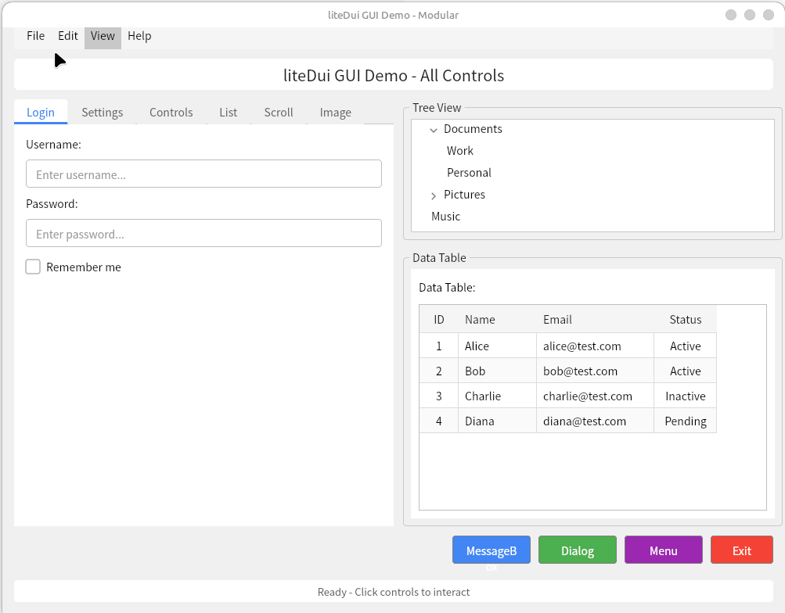

# liteDui
Simple Direct User Interface Framework. 虽然叫lite GUI, 但是一点也不简单。

## 架构说明
- 使用 CMake C++17 开发，首先支持 Linux 平台
- 窗口管理使用 GLFW
- 通过 OpenGL 提供给 Skia 进行绘制
    - 富文本和文本排版
    - 图像
    - 路径
    - 渐变
    - 矢量/svg
    - 创建控件：按钮，文本框，图片，组合框，GroupBox, 可滚动容器，Tab，树控件，浏览器，表格，List
- 使用 Yoga 提供 Flex Layout 管理
- 支持 CSS 属性美化样式
- 支持 XML 定制 Form
- 导出为 C ABI
- 资源管理 (image/font/css)

后续辅助项目：
- QuickJS 嵌入，支持全程通过 JS 实现 GUI 和功能
- 添加 Golang/Python/Rust 语言支持
- 支持更多平台 (Android, Windows, Linux, MacOS)
- Skia 瘦身，自定义构建
- 从网络进行资源加载

## 参考
- [DuiLib_Ultimate](https://github.com/qdtroy/DuiLib_Ultimate)
- [Flutter](https://github.com/flutter/flutter)
- [Yoga](https://github.com/facebook/yoga)
- [Skia](https://github.com/google/skia)
- [QuickJS](https://github.com/bellard/quickjs)

预编译的 Skia:
- [SkiaBuild](https://github.com/HumbleUI/SkiaBuild)
- [Skia Builder](https://github.com/olilarkin/skia-builder)


## 已实现控件
|------|------|------|
| 基础设施 | LiteLayout | Yoga Flexbox 布局基类 |
| | LiteContainer | 容器基类，支持背景、边框、文本绘制 |
| | LiteWindow | GLFW 窗口管理，Overlay 弹出层 |
| | LiteFontManager | 全局字体管理器 (Skia Paragraph) |
| | LiteSkiaRenderer | Skia OpenGL 渲染器 |
| 基础控件 | LiteLabel | 文本标签，单行/多行/省略号模式 |
| | LiteButton | 按钮，Normal/Hover/Pressed/Disabled 状态 |
| | LiteInput | 输入框，Text/Password/Number 类型 |
| | LiteCheckbox | 复选框 |
| | LiteRadioButton | 单选按钮 + RadioGroup 分组 |
| | LiteImage | 图片，None/Fit/Fill/Stretch 缩放模式 |
| 高级控件 | LiteComboBox | 下拉组合框，ReadOnly/Editable 模式 |
| | LiteSlider | 滑块，水平/垂直方向，刻度支持 |
| | LiteProgressBar | 进度条，确定/不确定模式 |
| | LiteScrollView | 可滚动容器，垂直/水平/双向滚动 |
| | LiteList | 列表控件 (基于 ScrollView) |
| | LiteTable | 表格控件 (基于 ScrollView) |
| | LiteTreeView | 树形控件 (基于 ScrollView) |
| | LiteTabView | 标签页，Top/Bottom 位置 |
| | LiteGroupBox | 分组框 |
| | LiteMenu / LiteMenuBar | 菜单系统，子菜单/快捷键/可勾选项 |
| 弹出层 | LiteDialog | 模态对话框基类 |
| | LiteMessageBox | 消息框，Information/Warning/Error/Question 图标 |
| | LiteTooltip | 工具提示，鼠标悬停显示 |
| | LiteFileDialog | 文件/文件夹选择对话框，OpenFile/OpenFolder/SaveFile 模式 |
| | LiteColorPicker | 颜色选择对话框，HSV 色彩空间，RGB/Hex 输入 |

**控件统计：** 5 个基础设施 + 6 个基础控件 + 10 个高级控件 + 5 个弹出层 = **26 个控件**


## 实施时间线

### 第一阶段 (4-6周)

- [x] Skia 渲染引擎集成
- [x] Yoga Flexbox 布局引擎
- [x] 基础组件系统 (Container, Button, Input)
- [x] 简单示例应用

### 第二阶段 (4-6周) - 进行中

- [x] CSS 样式系统（基础颜色、边框、字体）
- [x] 事件处理系统完善（鼠标、键盘、滚轮、焦点）
- [x] 高级组件实现
  - [x] LiteLabel - 文本标签
  - [x] LiteScrollView - 可滚动容器
  - [x] LiteImage - 图片控件
  - [x] LiteCheckbox - 复选框
  - [x] LiteRadioButton - 单选按钮
  - [x] LiteList - 列表控件
  - [x] LiteTable - 表格控件
  - [x] LiteTreeView - 树形控件
  - [x] LiteComboBox - 下拉组合框
  - [x] LiteTabView - 标签页
  - [x] LiteSlider - 滑块
  - [x] LiteProgressBar - 进度条
  - [x] LiteGroupBox - 分组框
  - [x] LiteMenu/LiteMenuBar - 菜单系统
  - [x] LiteDialog - 对话框基类
  - [x] LiteMessageBox - 消息框
  - [x] LiteTooltip - 工具提示
- [x] 性能优化（脏标记、增量渲染）
 [x] 文件对话框系统
  - [x] LiteFileDialog - 文件/文件夹选择对话框（支持 OpenFile/OpenFolder/SaveFile 三种模式）
 [x] 颜色选择器
  - [x] LiteColorPicker - 颜色选择对话框（HSV 色彩空间 + RGB/Hex 输入）
 [ ] 字体选择器
  - [ ] FontDialog - 字体选择对话框
- [ ] SVG 支持
  - [ ] SVG 图像渲染
  - [ ] 图标/图片资源管理系统
- [ ] XML Form Builder
  - [ ] XML 布局解析器
  - [ ] 声明式 UI 构建
- [ ] CSS Style Parser
  - [ ] CSS 样式表解析
  - [ ] 样式继承和层叠

### 第三阶段 (3-4周) - 未开始

- [ ] 主题系统
  - [ ] 深色/浅色主题
  - [ ] 主题切换机制
  - [ ] 自定义主题支持
- [ ] C API
  - [ ] 导出 C 语言接口
  - [ ] 跨语言绑定支持

---

## 项目进度

**第一阶段：** ✅ 100% 完成

**第二阶段：** 🚧 约 65% 完成
 ✅ 核心控件系统（26 个控件全部实现）
- ✅ 事件处理和渲染优化
 ✅ 对话框扩展（文件/颜色选择完成，字体选择待实现）
- ❌ 资源管理（SVG/主题/XML/CSS 解析）

**第三阶段：** ⏳ 0% 完成

---
- [ ] React Native API
  - [ ] React Native 风格 API 设计
- [ ] QuickJS 集成（可选）
  - [ ] JavaScript 引擎嵌入
  - [ ] JS 脚本化 GUI
- [ ] 资源管理系统
  - [ ] 统一资源加载
  - [ ] 资源缓存机制
  - [ ] 异步加载支持
- [ ] 多平台支持扩展
  - [ ] Windows 平台适配
  - [ ] macOS 平台适配
  - [ ] Android 平台适配
- [ ] 文档和示例
  - [ ] API 文档完善
  - [ ] 更多示例应用
  - [ ] 开发者指南


## Build
```bash
# 克隆项目
git clone <repo>
cd liteDui

# 创建构建目录
mkdir build && cd build

# 配置和构建
cmake ..
make -j$(nproc)

# 运行示例
./bin/01_glfw_win
./bin/04_gui_demo
```
