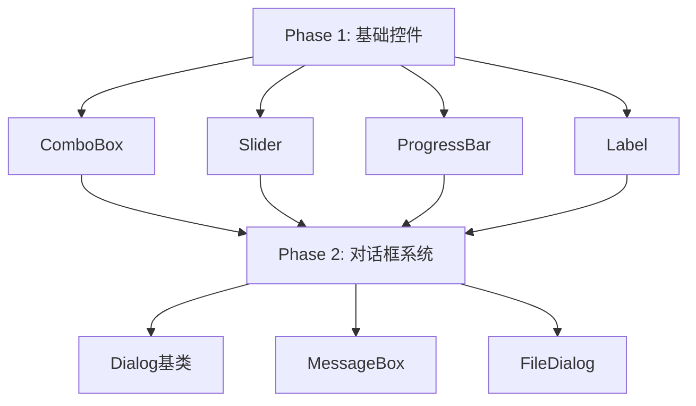

# liteDui GUI 控件缺失分析报告

## 一、已实现控件清单

### 1.1 基础控件（10个）

| 控件名称 | 文件 | 功能描述 | 完成度 |
|---------|------|---------|--------|
| [`LiteButton`](../include/lite_button.h) | lite_button.h/cpp | 按钮控件，支持多状态（Normal/Hover/Pressed/Disabled） | ✅ 完整 |
| [`LiteCheckbox`](../include/lite_checkbox.h) | lite_checkbox.h/cpp | 复选框，支持选中/未选中状态 | ✅ 完整 |
| [`LiteRadioButton`](../include/lite_radio_button.h) | lite_radio_button.h/cpp | 单选按钮，支持分组管理（RadioGroup） | ✅ 完整 |
| [`LiteInput`](../include/lite_input.h) | lite_input.h/cpp | 输入框，支持文本/密码/数字类型，光标和选择 | ✅ 完整 |
| [`LiteImage`](../include/lite_image.h) | lite_image.h/cpp | 图片控件，支持多种缩放模式 | ✅ 完整 |
| [`LiteList`](../include/lite_list.h) | lite_list.h/cpp | 列表控件，支持单选/多选，可滚动 | ✅ 完整 |
| [`LiteTable`](../include/lite_table.h) | lite_table.h/cpp | 表格控件，支持多列、表头、行选择 | ✅ 完整 |
| [`LiteScrollView`](../include/lite_scroll_view.h) | lite_scroll_view.h/cpp | 可滚动容器，支持垂直/水平滚动 | ✅ 完整 |
| [`LiteGroupBox`](../include/lite_group_box.h) | lite_group_box.h/cpp | 分组框，带标题的容器 | ✅ 完整 |
| [`LiteTabView`](../include/lite_tab_view.h) | lite_tab_view.h/cpp | 标签页控件，支持多标签切换 | ✅ 完整 |

### 1.2 核心基础设施

| 组件 | 文件 | 功能 |
|------|------|------|
| [`LiteContainer`](../include/lite_container.h) | lite_container.h/cpp | 容器基类，支持背景、边框、文本 |
| [`LiteLayout`](../include/lite_layout.h) | lite_layout.h/cpp | Flexbox 布局引擎（基于 Yoga） |
| [`LiteWindow`](../include/lite_window.h) | lite_window.h/cpp | 窗口管理（基于 GLFW） |
| [`LiteSkiaRenderer`](../include/lite_skia_renderer.h) | lite_skia_renderer.h/cpp | Skia 渲染引擎 |
| [`LiteFontManager`](../include/lite_font_manager.h) | lite_font_manager.h/cpp | 字体管理 |

---

## 二、主流 GUI 框架对比

### 2.1 MFC（Microsoft Foundation Classes）常用控件

#### 已实现 ✅
- CButton → [`LiteButton`](../include/lite_button.h)
- CEdit → [`LiteInput`](../include/lite_input.h)
- CStatic（图片） → [`LiteImage`](../include/lite_image.h)
- CCheckBox → [`LiteCheckbox`](../include/lite_checkbox.h)
- CRadioButton → [`LiteRadioButton`](../include/lite_radio_button.h)
- CListBox/CListCtrl → [`LiteList`](../include/lite_list.h)
- CTabCtrl → [`LiteTabView`](../include/lite_tab_view.h)
- CScrollBar（内置于 ScrollView）

#### 缺失 ❌
- **CComboBox** - 下拉组合框（重要）
- **CSliderCtrl** - 滑块控件（重要）
- **CProgressCtrl** - 进度条（重要）
- **CSpinButtonCtrl** - 数字调节器
- **CTreeCtrl** - 树形控件（重要）
- **CRichEditCtrl** - 富文本编辑器
- **CDateTimeCtrl** - 日期时间选择器
- **CMonthCalCtrl** - 月历控件
- **CToolBar** - 工具栏
- **CStatusBar** - 状态栏
- **CMenuBar** - 菜单栏（重要）
- **CToolTipCtrl** - 工具提示
- **CSplitterWnd** - 分割窗口

### 2.2 Qt 常用控件

#### 已实现 ✅
- QPushButton → [`LiteButton`](../include/lite_button.h)
- QLineEdit → [`LiteInput`](../include/lite_input.h)
- QLabel（图片） → [`LiteImage`](../include/lite_image.h)
- QCheckBox → [`LiteCheckbox`](../include/lite_checkbox.h)
- QRadioButton → [`LiteRadioButton`](../include/lite_radio_button.h)
- QListWidget → [`LiteList`](../include/lite_list.h)
- QTableWidget → [`LiteTable`](../include/lite_table.h)
- QScrollArea → [`LiteScrollView`](../include/lite_scroll_view.h)
- QGroupBox → [`LiteGroupBox`](../include/lite_group_box.h)
- QTabWidget → [`LiteTabView`](../include/lite_tab_view.h)

#### 缺失 ❌
- **QComboBox** - 下拉组合框（重要）
- **QSlider** - 滑块（重要）
- **QProgressBar** - 进度条（重要）
- **QSpinBox/QDoubleSpinBox** - 数字调节器（重要）
- **QTreeWidget/QTreeView** - 树形控件（重要）
- **QTextEdit** - 多行文本编辑器（重要）
- **QPlainTextEdit** - 纯文本编辑器
- **QDateEdit/QTimeEdit/QDateTimeEdit** - 日期时间选择器
- **QCalendarWidget** - 日历控件
- **QDial** - 旋钮控件
- **QLCDNumber** - LCD 数字显示
- **QToolBar** - 工具栏
- **QStatusBar** - 状态栏
- **QMenuBar/QMenu** - 菜单系统（重要）
- **QToolTip** - 工具提示
- **QSplitter** - 分割器（重要）
- **QDockWidget** - 停靠窗口
- **QDialog** - 对话框基类（重要）
- **QMessageBox** - 消息框（重要）
- **QFileDialog** - 文件对话框（重要）
- **QColorDialog** - 颜色选择对话框
- **QFontDialog** - 字体选择对话框

### 2.3 DirectUI 常用控件

#### 已实现 ✅
- Button → [`LiteButton`](../include/lite_button.h)
- Edit → [`LiteInput`](../include/lite_input.h)
- Label（图片） → [`LiteImage`](../include/lite_image.h)
- CheckBox → [`LiteCheckbox`](../include/lite_checkbox.h)
- Option（RadioButton） → [`LiteRadioButton`](../include/lite_radio_button.h)
- List → [`LiteList`](../include/lite_list.h)
- TabLayout → [`LiteTabView`](../include/lite_tab_view.h)
- ScrollBar（内置）

#### 缺失 ❌
- **Combo** - 下拉组合框（重要）
- **Slider** - 滑块（重要）
- **Progress** - 进度条（重要）
- **TreeView** - 树形控件（重要）
- **RichEdit** - 富文本编辑器
- **DateTime** - 日期时间选择器
- **Menu** - 菜单（重要）
- **ToolBar** - 工具栏
- **StatusBar** - 状态栏
- **Tooltip** - 工具提示
- **WebBrowser** - 浏览器控件

---

## 三、缺失控件优先级分类

### 3.1 高优先级（核心基础控件）⭐⭐⭐

这些控件在几乎所有 GUI 应用中都会用到：

1. **ComboBox（下拉组合框）**
   - 用途：选择列表项，节省空间
   - 特性：下拉列表、可编辑/只读模式、自动完成
   - 参考：Qt QComboBox, MFC CComboBox

2. **Slider（滑块）**
   - 用途：数值范围选择（音量、亮度等）
   - 特性：水平/垂直方向、刻度显示、范围限制
   - 参考：Qt QSlider, MFC CSliderCtrl

3. **ProgressBar（进度条）**
   - 用途：显示任务进度
   - 特性：确定/不确定模式、百分比显示、样式定制
   - 参考：Qt QProgressBar, MFC CProgressCtrl

4. **Label（文本标签）**
   - 用途：显示静态文本和图标
   - 特性：文本换行、富文本、超链接
   - 注：当前 [`LiteContainer`](../include/lite_container.h) 可显示文本，但需要独立的 Label 控件

5. **TreeView（树形控件）**
   - 用途：层级数据展示（文件系统、组织结构）
   - 特性：展开/折叠、多选、拖拽、图标
   - 参考：Qt QTreeWidget, MFC CTreeCtrl

6. **Menu/MenuBar（菜单系统）**
   - 用途：应用程序主菜单
   - 特性：多级菜单、快捷键、分隔符、图标
   - 参考：Qt QMenu/QMenuBar, MFC CMenu

7. **Dialog（对话框）**
   - 用途：模态/非模态对话框基类
   - 特性：标准按钮、返回值、居中显示
   - 参考：Qt QDialog, MFC CDialog

8. **MessageBox（消息框）**
   - 用途：显示提示、警告、错误信息
   - 特性：标准图标、按钮组合、返回值
   - 参考：Qt QMessageBox, MFC MessageBox

### 3.2 中优先级（常用控件）⭐⭐

这些控件在许多应用中会用到：

9. **SpinBox（数字调节器）**
   - 用途：数字输入和调节
   - 特性：上下按钮、范围限制、步长设置
   - 参考：Qt QSpinBox, MFC CSpinButtonCtrl

10. **TextEdit（多行文本编辑器）**
    - 用途：多行文本输入和编辑
    - 特性：滚动、换行、只读模式
    - 参考：Qt QTextEdit, MFC CEdit（多行）

11. **Splitter（分割器）**
    - 用途：可调整大小的分割布局
    - 特性：水平/垂直分割、拖拽调整
    - 参考：Qt QSplitter, MFC CSplitterWnd

12. **ToolBar（工具栏）**
    - 用途：快速访问常用功能
    - 特性：图标按钮、可停靠、可定制
    - 参考：Qt QToolBar, MFC CToolBar

13. **StatusBar（状态栏）**
    - 用途：显示状态信息
    - 特性：多区域、进度条、图标
    - 参考：Qt QStatusBar, MFC CStatusBar

14. **ToolTip（工具提示）**
    - 用途：鼠标悬停时显示帮助信息
    - 特性：自动显示/隐藏、延迟、富文本
    - 参考：Qt QToolTip, MFC CToolTipCtrl

15. **FileDialog（文件对话框）**
    - 用途：文件选择和保存
    - 特性：文件过滤、多选、预览
    - 参考：Qt QFileDialog, MFC CFileDialog

16. **DateTimePicker（日期时间选择器）**
    - 用途：日期和时间输入
    - 特性：日历弹出、格式化、范围限制
    - 参考：Qt QDateTimeEdit, MFC CDateTimeCtrl

### 3.3 低优先级（特殊用途控件）⭐

这些控件用于特定场景：

17. **RichTextEdit（富文本编辑器）**
    - 用途：格式化文本编辑
    - 特性：字体、颜色、对齐、图片插入
    - 参考：Qt QTextEdit, MFC CRichEditCtrl

18. **Calendar（日历控件）**
    - 用途：日期选择和显示
    - 特性：月视图、多选、标记日期
    - 参考：Qt QCalendarWidget, MFC CMonthCalCtrl

19. **ColorPicker（颜色选择器）**
    - 用途：颜色选择
    - 特性：调色板、RGB/HSV、自定义颜色
    - 参考：Qt QColorDialog

20. **FontPicker（字体选择器）**
    - 用途：字体选择
    - 特性：字体列表、样式、大小预览
    - 参考：Qt QFontDialog

21. **DockWidget（停靠窗口）**
    - 用途：可停靠的工具面板
    - 特性：拖拽停靠、浮动、关闭
    - 参考：Qt QDockWidget

22. **Dial（旋钮控件）**
    - 用途：旋转式数值调节
    - 特性：圆形旋钮、范围、刻度
    - 参考：Qt QDial

23. **LCDNumber（LCD 数字显示）**
    - 用途：数字显示（计时器、计数器）
    - 特性：LCD 样式、多位数
    - 参考：Qt QLCDNumber

---

## 四、缺失功能特性分析

### 4.1 事件系统增强

当前实现：
- ✅ 基础鼠标事件（pressed, released, moved, entered, exited）
- ✅ 键盘事件（keyPressed, charInput）
- ✅ 滚轮事件（scroll）
- ✅ 焦点事件（focusGained, focusLost）

缺失功能：
- ❌ **双击事件**（double click）
- ❌ **右键菜单事件**（context menu）
- ❌ **拖拽事件**（drag & drop）
- ❌ **触摸事件**（touch events，移动端）
- ❌ **手势识别**（gestures）
- ❌ **事件过滤器**（event filter）
- ❌ **事件传播控制**（event propagation）

### 4.2 动画系统

当前实现：
- ✅ 基础更新循环（[`update()`](../include/lite_layout.h:102)）

缺失功能：
- ❌ **属性动画**（property animation）
- ❌ **缓动函数**（easing functions）
- ❌ **动画组**（animation group）
- ❌ **过渡效果**（transitions）
- ❌ **关键帧动画**（keyframe animation）

### 4.3 样式系统

当前实现：
- ✅ 基础颜色设置（背景、文本、边框）
- ✅ 边框圆角
- ✅ 字体设置

缺失功能：
- ❌ **CSS 样式表**（stylesheet）
- ❌ **主题系统**（theme system）
- ❌ **样式继承**（style inheritance）
- ❌ **伪状态样式**（:hover, :pressed, :disabled）
- ❌ **阴影效果**（box-shadow, text-shadow）
- ❌ **渐变背景**（gradient）
- ❌ **图片背景**（background-image）
- ❌ **透明度**（opacity）

### 4.4 布局系统增强

当前实现：
- ✅ Flexbox 布局（基于 Yoga）
- ✅ 边距、内边距、边框
- ✅ 对齐方式

缺失功能：
- ❌ **Grid 布局**（CSS Grid）
- ❌ **绝对定位**（absolute positioning，部分支持）
- ❌ **Z-Index**（层级控制）
- ❌ **布局约束**（constraints）
- ❌ **响应式布局**（responsive layout）

### 4.5 数据绑定

缺失功能：
- ❌ **数据模型**（data model）
- ❌ **视图-模型绑定**（view-model binding）
- ❌ **数据验证**（validation）
- ❌ **数据转换**（data conversion）

### 4.6 国际化

缺失功能：
- ❌ **多语言支持**（i18n）
- ❌ **文本翻译**（translation）
- ❌ **RTL 支持**（right-to-left）
- ❌ **区域设置**（locale）

### 4.7 辅助功能

缺失功能：
- ❌ **键盘导航**（tab navigation）
- ❌ **快捷键系统**（shortcuts）
- ❌ **屏幕阅读器支持**（accessibility）
- ❌ **焦点指示器**（focus indicator）

### 4.8 资源管理

当前实现：
- ✅ 图片加载（[`LiteImage`](../include/lite_image.h)）
- ✅ 字体管理（[`LiteFontManager`](../include/lite_font_manager.h)）

缺失功能：
- ❌ **资源缓存**（resource cache）
- ❌ **异步加载**（async loading）
- ❌ **图标系统**（icon system）
- ❌ **SVG 支持**（vector graphics）

### 4.9 剪贴板

缺失功能：
- ❌ **复制/粘贴**（copy/paste）
- ❌ **剪切**（cut）
- ❌ **剪贴板监听**（clipboard monitoring）

### 4.10 打印支持

缺失功能：
- ❌ **打印预览**（print preview）
- ❌ **页面设置**（page setup）
- ❌ **PDF 导出**（PDF export）

---

## 五、实现建议

### 5.1 短期目标（1-2个月）

实现高优先级的核心控件：



### 5.2 中期目标（3-6个月）

实现中优先级控件和功能增强：

1. **TreeView** - 树形控件
2. **Menu/MenuBar** - 菜单系统
3. **SpinBox** - 数字调节器
4. **TextEdit** - 多行文本编辑器
5. **Splitter** - 分割器
6. **ToolBar/StatusBar** - 工具栏和状态栏
7. **ToolTip** - 工具提示
8. **动画系统** - 基础属性动画
9. **样式系统增强** - CSS 样式表支持
10. **事件系统增强** - 双击、右键菜单、拖拽

### 5.3 长期目标（6-12个月）

实现低优先级控件和高级功能：

1. **RichTextEdit** - 富文本编辑器
2. **Calendar/DateTimePicker** - 日期时间控件
3. **ColorPicker/FontPicker** - 选择器对话框
4. **DockWidget** - 停靠窗口
5. **数据绑定系统**
6. **国际化支持**
7. **辅助功能**
8. **打印支持**

---

## 六、技术架构建议

### 6.1 控件继承体系

```
LiteLayout (Yoga布局)
    └── LiteContainer (背景、边框、文本)
        ├── LiteButton
        ├── LiteLabel (新增)
        ├── LiteInput
        ├── LiteCheckbox
        ├── LiteRadioButton
        ├── LiteImage
        ├── LiteGroupBox
        ├── LiteScrollView
        │   ├── LiteList
        │   ├── LiteTable
        │   ├── LiteTreeView (新增)
        │   └── LiteTextEdit (新增)
        ├── LiteComboBox (新增)
        ├── LiteSlider (新增)
        ├── LiteProgressBar (新增)
        ├── LiteSpinBox (新增)
        ├── LiteTabView
        ├── LiteSplitter (新增)
        └── LiteDialog (新增)
            ├── LiteMessageBox (新增)
            ├── LiteFileDialog (新增)
            ├── LiteColorDialog (新增)
            └── LiteFontDialog (新增)
```

### 6.2 新增模块建议

1. **lite_animation.h/cpp** - 动画系统
2. **lite_style.h/cpp** - 样式系统
3. **lite_menu.h/cpp** - 菜单系统
4. **lite_dialog.h/cpp** - 对话框基类
5. **lite_clipboard.h/cpp** - 剪贴板管理
6. **lite_resource.h/cpp** - 资源管理
7. **lite_i18n.h/cpp** - 国际化支持

---

## 七、总结

### 7.1 当前状态

liteDui 已经实现了一个**坚实的基础**：
- ✅ 10 个基础控件
- ✅ 完整的 Flexbox 布局系统
- ✅ Skia 渲染引擎
- ✅ 基础事件处理
- ✅ 字体管理

### 7.2 主要差距

与成熟的 GUI 框架（MFC、Qt、DirectUI）相比，主要缺失：
- ❌ **23 个常用控件**（其中 8 个高优先级）
- ❌ **对话框系统**（MessageBox、FileDialog 等）
- ❌ **菜单系统**（Menu、MenuBar、ContextMenu）
- ❌ **动画系统**
- ❌ **样式系统**（CSS 样式表）
- ❌ **高级事件**（双击、拖拽、右键菜单）
- ❌ **数据绑定**
- ❌ **国际化支持**

### 7.3 优势

liteDui 的优势在于：
- 🎯 **轻量级**：代码简洁，易于理解和扩展
- 🎯 **现代化**：使用 Skia 渲染，支持 Flexbox 布局
- 🎯 **跨平台**：基于 GLFW 和 Skia
- 🎯 **良好的架构**：清晰的继承体系，易于添加新控件

### 7.4 建议

1. **优先实现高优先级控件**（ComboBox、Slider、ProgressBar、Label、TreeView、Menu、Dialog、MessageBox）
2. **完善事件系统**（双击、右键菜单、拖拽）
3. **添加动画支持**（属性动画、缓动函数）
4. **增强样式系统**（CSS 样式表、主题）
5. **保持代码质量**（文档、测试、示例）

---

## 八、参考资源

- **Qt 文档**: https://doc.qt.io/qt-6/widget-classes.html
- **MFC 文档**: https://learn.microsoft.com/en-us/cpp/mfc/
- **Skia 文档**: https://skia.org/docs/
- **Yoga 布局**: https://yogalayout.com/
- **GLFW 文档**: https://www.glfw.org/documentation.html

---

*报告生成时间：2026-01-24*
*项目路径：/home/andy/mycode/test1/liteDui*


短期（1-2个月）：实现 ComboBox、Slider、ProgressBar、Label、Dialog、MessageBox

中期（3-6个月）：实现 TreeView、Menu、SpinBox、TextEdit、Splitter、动画系统、样式增强

长期（6-12个月）：实现富文本编辑器、日期时间控件、数据绑定、国际化