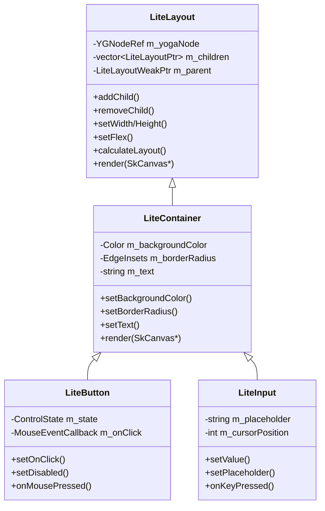

# liteDui Layout 和 GUI 控件实现计划

## 项目概述

基于 README.md 的架构说明，参考 refs/sgui 的实现，使用 Skia + Yoga 库完善 src 文件夹里的 layout 和 gui 控件。

## 技术栈

- **渲染引擎**: Skia (替代 sgui 中的 Cairo)
- **布局引擎**: Yoga (Facebook 的 Flexbox 布局库)
- **窗口管理**: GLFW
- **语言标准**: C++17

## 架构设计



## 文件结构

```
include/
├── lite_common.h          # 公共类型定义
├── lite_layout.h          # 布局基类头文件
├── lite_container.h       # 容器类头文件
├── lite_button.h          # 按钮控件头文件
├── lite_input.h           # 输入框控件头文件
└── lite_window.h          # 已存在

src/
├── layout/
│   ├── lite_layout.cpp    # 布局基类实现
│   └── lite_container.cpp # 容器类实现
├── controls/
│   ├── lite_button.cpp    # 按钮控件实现
│   └── lite_input.cpp     # 输入框控件实现
└── window/
    └── lite_window.cpp    # 已存在

examples/
└── 03_layout_controls/
    ├── CMakeLists.txt
    └── main.cpp           # 演示 demo
```

## 实现步骤

### 步骤 1: 创建公共类型定义 (lite_common.h)

参考 sgui_common.h，定义以下内容：
- Color 结构体
- Rect 结构体  
- LayoutValue 结构体
- EdgeInsets 结构体
- FlexDirection/Align/PositionType 等枚举
- MouseEvent/KeyEvent 结构体
- ControlState 枚举

### 步骤 2: 实现布局基类 (lite_layout.h/cpp)

基于 Yoga 实现 Flexbox 布局：
- 子节点管理 (addChild/removeChild)
- 尺寸设置 (setWidth/setHeight/setMinWidth 等)
- Flex 属性 (setFlex/setFlexGrow/setFlexShrink)
- 对齐方式 (setJustifyContent/setAlignItems)
- 边距设置 (setMargin/setPadding/setBorder)
- 布局计算 (calculateLayout)
- 虚函数 render(SkCanvas*) 供子类重写

### 步骤 3: 实现容器基类 (lite_container.h/cpp)

继承 LiteLayout，添加样式属性：
- 背景相关 (backgroundColor/backgroundGradient)
- 边框样式 (borderColor/borderStyle/borderRadius)
- 文本样式 (textColor/fontSize/fontFamily)
- 使用 Skia 绘制：
  - drawBackgroundSkia() - 使用 SkCanvas::drawRRect
  - drawBorderSkia() - 使用 SkPaint stroke
  - drawTextSkia() - 使用 skparagraph 模块

### 步骤 4: 实现 Button 控件 (lite_button.h/cpp)

继承 LiteContainer：
- 状态管理 (Normal/Hover/Pressed/Disabled)
- 各状态颜色配置
- 鼠标事件处理
- 点击回调

### 步骤 5: 实现 Input 控件 (lite_input.h/cpp)

继承 LiteContainer：
- 输入类型 (Text/Password/Number)
- 光标管理和闪烁
- 文本选择
- 键盘事件处理
- 撤销/重做支持

### 步骤 6: 更新 CMakeLists.txt

- 添加 Skia 依赖配置
- 添加新的源文件
- 配置 include 路径

### 步骤 7: 创建 Demo 示例

演示内容：
- 创建窗口
- 使用 Flex 布局排列控件
- 展示 Button 和 Input 控件
- 事件处理演示

## Skia 绘制 API 对照

| 功能 | Cairo API | Skia API |
|------|-----------|----------|
| 矩形 | cairo_rectangle | SkCanvas::drawRect |
| 圆角矩形 | 手动绘制弧线 | SkCanvas::drawRRect |
| 填充 | cairo_fill | SkPaint::setStyle(kFill_Style) |
| 描边 | cairo_stroke | SkPaint::setStyle(kStroke_Style) |
| 颜色 | cairo_set_source_rgba | SkPaint::setColor |
| 文本 | cairo_show_text | skparagraph::Paragraph::paint |
| 渐变 | cairo_pattern_create_linear | SkGradientShader::MakeLinear |
| 裁剪 | cairo_clip | SkCanvas::clipRect |
| 保存/恢复 | cairo_save/restore | SkCanvas::save/restore |

## 关键实现细节

### 1. Skia 渲染上下文

```cpp
// 使用 SkCanvas 替代 cairo_t
void LiteContainer::render(SkCanvas* canvas) {
    if (!canvas) return;
    
    canvas->save();
    
    // 绘制背景
    drawBackgroundSkia(canvas, x, y, width, height);
    
    // 绘制边框
    drawBorderSkia(canvas, x, y, width, height);
    
    // 绘制文本
    drawTextSkia(canvas, x, y, width, height);
    
    canvas->restore();
}
```

### 2. 圆角矩形绘制

```cpp
void drawRoundedRect(SkCanvas* canvas, float x, float y, 
                     float w, float h, float radius) {
    SkRRect rrect = SkRRect::MakeRectXY(
        SkRect::MakeXYWH(x, y, w, h), radius, radius);
    canvas->drawRRect(rrect, paint);
}
```

### 3. 文本绘制 (使用 skparagraph)

```cpp
void drawText(SkCanvas* canvas, const std::string& text, 
              float x, float y, float maxWidth) {
    auto fontCollection = sk_make_sp<FontCollection>();
    fontCollection->setDefaultFontManager(SkFontMgr::RefDefault());
    
    ParagraphStyle paraStyle;
    TextStyle textStyle;
    textStyle.setColor(m_textColor);
    textStyle.setFontSize(m_fontSize);
    
    auto builder = ParagraphBuilder::make(paraStyle, fontCollection);
    builder->pushStyle(textStyle);
    builder->addText(text.c_str());
    
    auto paragraph = builder->Build();
    paragraph->layout(maxWidth);
    paragraph->paint(canvas, x, y);
}
```

## 依赖配置

CMakeLists.txt 需要添加：

```cmake
# Skia 配置
set(SKIA_DIR "/path/to/skia")
find_library(SKIA_LIB skia PATHS ${SKIA_DIR}/out/Release)
target_include_directories(litedui PUBLIC ${SKIA_DIR})
target_link_libraries(litedui PUBLIC ${SKIA_LIB})
```

## 测试计划

1. 单元测试：布局计算正确性
2. 集成测试：控件渲染和事件响应
3. Demo 验证：完整功能演示
