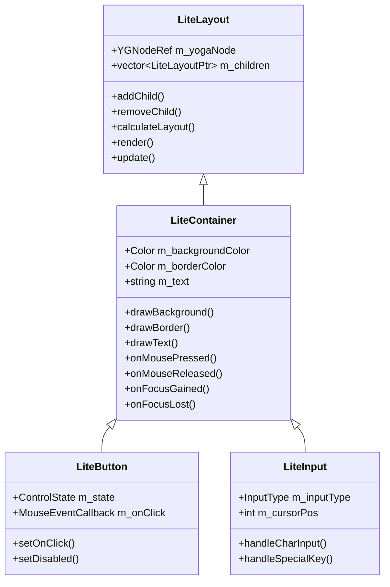

# liteDui 新控件实现计划

## 概述

本计划描述了为 liteDui 框架实现以下新控件的详细设计和实施步骤：
- **LiteImage** - 图片控件
- **LiteCheckbox** - 复选框控件  
- **LiteRadioButton** - 单选按钮控件
- **LiteList** - 列表控件
- **LiteScrollView** - 可滚动区域控件

## 现有架构分析

### 控件继承体系



### 关键实现模式

1. **状态管理**: 使用 `ControlState` 枚举管理控件状态 (Normal, Hover, Pressed, Focused, Disabled)
2. **事件处理**: 通过虚函数 `onMousePressed`, `onMouseReleased`, `onMouseEntered`, `onMouseExited` 等处理事件
3. **渲染流程**: 重写 `render()` 方法，调用 `drawBackground()`, `drawBorder()`, `drawText()` 等辅助方法
4. **脏标记**: 使用 `markDirty()` 标记需要重绘，优化渲染性能
5. **回调机制**: 使用 `std::function` 定义回调类型

---

## 新控件设计

### 1. LiteImage - 图片控件

#### 功能需求
- 从文件路径加载图片 (PNG, JPEG, WebP)
- 支持多种缩放模式 (Fit, Fill, Stretch, None)
- 支持圆角显示
- 支持图片加载失败时显示占位符

#### 类设计

```cpp
// include/lite_image.h
enum class ImageScaleMode {
    None,       // 原始大小
    Fit,        // 保持比例适应容器
    Fill,       // 保持比例填充容器，可能裁剪
    Stretch     // 拉伸填充容器
};

class LiteImage : public LiteContainer {
public:
    LiteImage();
    explicit LiteImage(const std::string& path);
    
    void setImagePath(const std::string& path);
    void setScaleMode(ImageScaleMode mode);
    void setPlaceholderColor(const Color& color);
    
    void render(SkCanvas* canvas) override;
    
private:
    std::string m_imagePath;
    sk_sp<SkImage> m_image;
    ImageScaleMode m_scaleMode = ImageScaleMode::Fit;
    Color m_placeholderColor = Color::LightGray();
    bool m_loadFailed = false;
    
    void loadImage();
    void drawImage(SkCanvas* canvas, float x, float y, float w, float h);
};
```

#### 实现要点
- 使用 Skia 的 `SkImage::MakeFromEncoded()` 加载图片
- 使用 `SkSamplingOptions` 控制缩放质量
- 缓存已加载的图片避免重复加载

---

### 2. LiteCheckbox - 复选框控件

#### 功能需求
- 支持选中/未选中状态切换
- 支持禁用状态
- 支持自定义选中图标样式
- 支持标签文本

#### 类设计

```cpp
// include/lite_checkbox.h
class LiteCheckbox : public LiteContainer {
public:
    LiteCheckbox();
    explicit LiteCheckbox(const std::string& label);
    
    void setChecked(bool checked);
    bool isChecked() const;
    void setLabel(const std::string& label);
    void setDisabled(bool disabled);
    
    void setOnChanged(std::function<void(bool)> callback);
    
    // 样式
    void setCheckColor(const Color& color);
    void setBoxSize(float size);
    
    void render(SkCanvas* canvas) override;
    void onMousePressed(const MouseEvent& event) override;
    void onMouseEntered(const MouseEvent& event) override;
    void onMouseExited(const MouseEvent& event) override;
    
private:
    bool m_checked = false;
    std::string m_label;
    ControlState m_state = ControlState::Normal;
    float m_boxSize = 18.0f;
    Color m_checkColor = Color::fromRGB(66, 133, 244);
    std::function<void(bool)> m_onChanged;
    
    void drawCheckbox(SkCanvas* canvas, float x, float y);
    void drawCheckmark(SkCanvas* canvas, float x, float y, float size);
};
```

#### 实现要点
- 复选框由方框 + 勾选标记 + 标签文本组成
- 使用 Skia Path 绘制勾选标记
- 点击时切换选中状态并触发回调

---

### 3. LiteRadioButton - 单选按钮控件

#### 功能需求
- 支持单选组管理，同组内只能选中一个
- 支持禁用状态
- 支持标签文本

#### 类设计

```cpp
// include/lite_radio_button.h
class LiteRadioGroup;

class LiteRadioButton : public LiteContainer {
public:
    LiteRadioButton();
    explicit LiteRadioButton(const std::string& label);
    
    void setSelected(bool selected);
    bool isSelected() const;
    void setLabel(const std::string& label);
    void setDisabled(bool disabled);
    void setGroup(LiteRadioGroup* group);
    
    void setOnSelected(std::function<void()> callback);
    
    // 样式
    void setRadioColor(const Color& color);
    void setRadioSize(float size);
    
    void render(SkCanvas* canvas) override;
    void onMousePressed(const MouseEvent& event) override;
    void onMouseEntered(const MouseEvent& event) override;
    void onMouseExited(const MouseEvent& event) override;
    
private:
    bool m_selected = false;
    std::string m_label;
    ControlState m_state = ControlState::Normal;
    float m_radioSize = 18.0f;
    Color m_radioColor = Color::fromRGB(66, 133, 244);
    LiteRadioGroup* m_group = nullptr;
    std::function<void()> m_onSelected;
    
    void drawRadio(SkCanvas* canvas, float x, float y);
};

// 单选组管理器
class LiteRadioGroup {
public:
    void addRadio(LiteRadioButton* radio);
    void removeRadio(LiteRadioButton* radio);
    void setSelected(LiteRadioButton* radio);
    LiteRadioButton* getSelected() const;
    
private:
    std::vector<LiteRadioButton*> m_radios;
    LiteRadioButton* m_selected = nullptr;
};
```

#### 实现要点
- 单选按钮由圆形外框 + 内部填充圆 + 标签文本组成
- 使用 `LiteRadioGroup` 管理同组单选按钮的互斥选择
- 选中时通知组内其他按钮取消选中

---

### 4. LiteScrollView - 可滚动区域控件

#### 功能需求
- 支持垂直和水平滚动
- 支持滚动条显示/隐藏
- 支持鼠标滚轮滚动
- 支持内容裁剪

#### 类设计

```cpp
// include/lite_scroll_view.h
enum class ScrollDirection {
    Vertical,
    Horizontal,
    Both
};

class LiteScrollView : public LiteContainer {
public:
    LiteScrollView();
    
    void setScrollDirection(ScrollDirection direction);
    void setShowScrollbar(bool show);
    void setScrollbarWidth(float width);
    
    void scrollTo(float x, float y);
    void scrollBy(float dx, float dy);
    float getScrollX() const;
    float getScrollY() const;
    
    // 设置内容容器
    void setContent(LiteContainerPtr content);
    LiteContainerPtr getContent() const;
    
    void render(SkCanvas* canvas) override;
    void onMousePressed(const MouseEvent& event) override;
    void onMouseReleased(const MouseEvent& event) override;
    void onMouseMoved(const MouseEvent& event) override;
    
    // 滚轮事件 - 需要在 LiteContainer 中添加
    virtual void onScroll(float xoffset, float yoffset);
    
private:
    LiteContainerPtr m_content;
    ScrollDirection m_scrollDirection = ScrollDirection::Vertical;
    float m_scrollX = 0.0f;
    float m_scrollY = 0.0f;
    bool m_showScrollbar = true;
    float m_scrollbarWidth = 8.0f;
    
    // 滚动条拖拽状态
    bool m_draggingScrollbar = false;
    float m_dragStartY = 0.0f;
    float m_dragStartScrollY = 0.0f;
    
    void clampScroll();
    void drawScrollbar(SkCanvas* canvas);
    bool isPointInScrollbar(float x, float y) const;
    float getContentHeight() const;
    float getViewportHeight() const;
};
```

#### 实现要点
- 使用 `SkCanvas::clipRect()` 裁剪超出视口的内容
- 使用 `SkCanvas::translate()` 实现滚动偏移
- 需要修改 `LiteWindow` 的 `ScrollCallback` 将滚轮事件传递给控件
- 滚动条支持拖拽操作

---

### 5. LiteList - 列表控件

#### 功能需求
- 支持垂直列表显示
- 支持单选/多选模式
- 支持列表项悬停高亮
- 基于 LiteScrollView 实现滚动

#### 类设计

```cpp
// include/lite_list.h
enum class ListSelectionMode {
    None,
    Single,
    Multiple
};

struct ListItem {
    std::string text;
    std::string id;
    bool selected = false;
    void* userData = nullptr;
};

class LiteList : public LiteScrollView {
public:
    LiteList();
    
    // 列表项管理
    void addItem(const std::string& text, const std::string& id = "");
    void removeItem(size_t index);
    void clearItems();
    size_t getItemCount() const;
    ListItem* getItem(size_t index);
    
    // 选择
    void setSelectionMode(ListSelectionMode mode);
    void setSelectedIndex(int index);
    int getSelectedIndex() const;
    std::vector<int> getSelectedIndices() const;
    
    // 样式
    void setItemHeight(float height);
    void setItemPadding(float padding);
    void setSelectedColor(const Color& color);
    void setHoverColor(const Color& color);
    
    // 回调
    void setOnSelectionChanged(std::function<void(int)> callback);
    void setOnItemClicked(std::function<void(int)> callback);
    
    void render(SkCanvas* canvas) override;
    void onMousePressed(const MouseEvent& event) override;
    void onMouseMoved(const MouseEvent& event) override;
    void onMouseExited(const MouseEvent& event) override;
    
private:
    std::vector<ListItem> m_items;
    ListSelectionMode m_selectionMode = ListSelectionMode::Single;
    int m_hoverIndex = -1;
    float m_itemHeight = 36.0f;
    float m_itemPadding = 12.0f;
    Color m_selectedColor = Color::fromRGB(66, 133, 244, 50);
    Color m_hoverColor = Color::fromRGB(200, 200, 200, 100);
    
    std::function<void(int)> m_onSelectionChanged;
    std::function<void(int)> m_onItemClicked;
    
    int getItemIndexAtY(float y) const;
    void updateContentSize();
    void drawItem(SkCanvas* canvas, size_t index, float y);
};
```

#### 实现要点
- 继承自 `LiteScrollView` 获得滚动能力
- 动态计算内容高度 = 项目数 × 项目高度
- 只渲染可见区域内的列表项以优化性能

---

## 需要修改的现有代码

### 1. lite_common.h - 添加新的回调类型

```cpp
// 新增回调类型
using CheckedChangedCallback = std::function<void(bool)>;
using SelectionChangedCallback = std::function<void(int)>;
using ScrollCallback = std::function<void(float, float)>;
```

### 2. lite_container.h - 添加滚轮事件处理

```cpp
// 在 LiteContainer 类中添加
virtual void onScroll(float xoffset, float yoffset) {}
```

### 3. lite_window.cpp - 完善滚轮事件分发

```cpp
void LiteWindow::ScrollCallback(GLFWwindow *window, double xoffset, double yoffset) {
    auto win = static_cast<LiteWindow *>(glfwGetWindowUserPointer(window));
    if (win && win->rootContainer_) {
        // 获取鼠标位置，找到目标控件
        double xpos, ypos;
        glfwGetCursorPos(window, &xpos, &ypos);
        
        float subx, suby;
        auto target = findDeepestContainerAtPosition(
            win->rootContainer_.get(), 
            static_cast<float>(xpos), 
            static_cast<float>(ypos), 
            subx, suby);
        
        if (target) {
            target->onScroll(static_cast<float>(xoffset), static_cast<float>(yoffset));
        }
    }
}
```

---

## 文件结构

新增文件：
```
include/
├── lite_image.h
├── lite_checkbox.h
├── lite_radio_button.h
├── lite_scroll_view.h
└── lite_list.h

src/controls/
├── lite_image.cpp
├── lite_checkbox.cpp
├── lite_radio_button.cpp
├── lite_scroll_view.cpp
└── lite_list.cpp
```

---

## 04_gui_demo 更新计划

更新后的 demo 将展示所有新控件：

```
┌─────────────────────────────────────────────────────────┐
│                   liteDui GUI Demo                       │
├─────────────────────────────────────────────────────────┤
│  ┌─────────────┐                                        │
│  │   Image     │   Username: [____________]             │
│  │  (Logo)     │   Password: [____________]             │
│  └─────────────┘                                        │
│                                                          │
│  ☑ Remember me    ○ Light Theme                         │
│  ☐ Auto login     ● Dark Theme                          │
│                                                          │
│  ┌─────────────────────────────────────────────────┐    │
│  │ Scrollable List:                                │    │
│  │ ├─ Item 1                                       │ ▲  │
│  │ ├─ Item 2 (selected)                            │ █  │
│  │ ├─ Item 3                                       │ █  │
│  │ └─ Item 4                                       │ ▼  │
│  └─────────────────────────────────────────────────┘    │
│                                                          │
│           [  Login  ]    [  Clear  ]                    │
│                                                          │
│                    Status Message                        │
└─────────────────────────────────────────────────────────┘
```

---

## 实施顺序

1. **LiteScrollView** - 基础滚动容器，LiteList 依赖它
2. **LiteImage** - 独立控件，无依赖
3. **LiteCheckbox** - 独立控件，无依赖
4. **LiteRadioButton** - 独立控件，包含 LiteRadioGroup
5. **LiteList** - 依赖 LiteScrollView
6. **更新 04_gui_demo** - 集成所有新控件
7. **测试验证** - 确保所有控件正常工作

---

## 注意事项

1. **内存管理**: 所有控件使用 `std::shared_ptr` 管理生命周期
2. **线程安全**: 当前框架为单线程，无需考虑线程安全
3. **性能优化**: 使用脏标记机制避免不必要的重绘
4. **UTF-8 支持**: 文本处理使用现有的 `Utf8Helper` 工具类
5. **Skia 资源**: 图片等资源需要正确管理 `sk_sp` 智能指针
