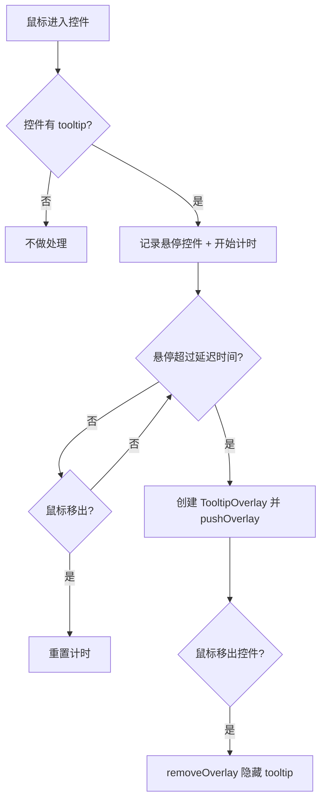

# Tooltip（Tips）控件设计方案

## 1. 需求概述

为 liteDui 框架实现 tooltip 功能：鼠标悬停在控件上一段时间后，在控件附近自动显示提示文本，鼠标移开后自动隐藏。使用方式为任意控件的附加属性 `setTooltip("提示文本")`。

## 2. 架构设计

### 2.1 核心思路

tooltip 的实现涉及三个层面：

1. **LiteContainer** — 存储 tooltip 文本属性
2. **LiteWindow** — 管理 tooltip 的悬停计时和显示/隐藏逻辑
3. **LiteTooltipOverlay** — 作为 overlay 渲染 tooltip 气泡

### 2.2 工作流程



### 2.3 关键设计决策

**为什么用 overlay 而不是直接在控件上绘制？**
- tooltip 需要显示在所有控件之上，不受父容器裁剪
- 复用现有的 overlay 渲染机制，保证层级正确
- 与 ComboBox 下拉列表的实现模式一致

**为什么计时逻辑放在 LiteWindow 而不是 LiteContainer？**
- LiteWindow 已有 `updateTree()` 循环，适合做帧级别的时间检测
- tooltip 是全局唯一的（同一时刻只显示一个），由 window 统一管理更合理
- 避免每个控件都维护计时器的开销

**tooltip overlay 不拦截事件**
- 与 ComboBox overlay 不同，tooltip overlay 不应该拦截鼠标事件
- tooltip 是纯展示性的，鼠标事件应该穿透到下层控件
- 需要在 LiteWindow 的事件分发中特殊处理

## 3. 接口设计

### 3.1 LiteContainer 新增接口

```cpp
// include/lite_container.h

class LiteContainer : public LiteLayout {
public:
    // Tooltip 属性
    void setTooltip(const std::string& text);
    const std::string& getTooltip() const;
    bool hasTooltip() const;

protected:
    std::string m_tooltip;
};
```

### 3.2 LiteTooltipOverlay 类

```cpp
// include/lite_tooltip.h

class LiteTooltipOverlay : public LiteContainer {
public:
    LiteTooltipOverlay();

    // 设置要显示的文本和位置
    void show(const std::string& text, float anchorX, float anchorY,
              float anchorW, float anchorH, float windowW, float windowH);

    void render(SkCanvas* canvas) override;

private:
    std::string m_tipText;
    float m_tipX = 0;      // tooltip 气泡左上角 X
    float m_tipY = 0;      // tooltip 气泡左上角 Y
    float m_tipWidth = 0;  // 气泡宽度
    float m_tipHeight = 0; // 气泡高度

    // 样式常量
    static constexpr float kPaddingH = 8.0f;
    static constexpr float kPaddingV = 4.0f;
    static constexpr float kFontSize = 12.0f;
    static constexpr float kBorderRadius = 4.0f;
    static constexpr float kGap = 4.0f;  // tooltip 与控件的间距
};
```

### 3.3 LiteWindow 新增 tooltip 管理

```cpp
// include/lite_window.h

class LiteWindow {
    // ... 现有接口 ...

private:
    // Tooltip 管理
    LiteContainer* tooltipTarget_ = nullptr;           // 当前悬停的有 tooltip 的控件
    std::chrono::steady_clock::time_point hoverStart_;  // 悬停开始时间
    bool tooltipVisible_ = false;                       // tooltip 是否正在显示
    std::shared_ptr<LiteTooltipOverlay> tooltipOverlay_; // tooltip overlay 实例

    static constexpr int kTooltipDelayMs = 500;         // 悬停延迟（毫秒）

    void updateTooltip(LiteContainer* currentHover);    // 更新 tooltip 状态
    void showTooltip();                                  // 显示 tooltip
    void hideTooltip();                                  // 隐藏 tooltip
};
```

## 4. 实现细节

### 4.1 tooltip 位置计算

tooltip 默认显示在目标控件下方，如果下方空间不足则显示在上方：

```
优先：控件下方
┌──────────┐
│  Button   │
└──────────┘
  ┌────────────┐
  │  tooltip   │
  └────────────┘

备选：控件上方（下方空间不足时）
  ┌────────────┐
  │  tooltip   │
  └────────────┘
┌──────────┐
│  Button   │
└──────────┘

水平方向：tooltip 左边缘与控件左边缘对齐，
如果超出窗口右边界则向左调整
```

### 4.2 事件分发修改

tooltip overlay 需要特殊处理 — 事件应穿透 tooltip：

```cpp
// 在 MousePosCallback 和 MouseButtonCallback 中：
// tooltip overlay 不参与事件分发，跳过它
// 只有非 tooltip 的 overlay 才拦截事件
```

具体做法：在 LiteWindow 中区分 tooltip overlay 和普通 overlay。tooltip 不放入 `overlays_` 栈，而是作为独立的渲染层，仅在 `Render()` 中最后绘制。

### 4.3 tooltip 生命周期

在 `dispatchMouseEvent` 中追踪 hover 目标变化：

```
1. 鼠标进入控件 A（有 tooltip）→ 记录 tooltipTarget_ = A，记录 hoverStart_
2. Render 循环中检查：当前时间 - hoverStart_ > 500ms → showTooltip()
3. 鼠标移出控件 A → hideTooltip()，重置 tooltipTarget_
4. 鼠标进入控件 B（有 tooltip）→ 重新开始计时
5. 鼠标进入控件 C（无 tooltip）→ hideTooltip()，tooltipTarget_ = nullptr
```

### 4.4 渲染集成

在 `LiteWindow::Render()` 中，tooltip 在所有 overlay 之后渲染：

```cpp
void LiteWindow::Render() {
    // ... 现有逻辑 ...
    if (canvas) {
        rootContainer_->renderTree(canvas);

        for (auto& overlay : overlays_) {
            canvas->save();
            canvas->resetMatrix();
            overlay->render(canvas);
            canvas->restore();
        }

        // tooltip 最后渲染，保证在最顶层
        if (tooltipVisible_ && tooltipOverlay_) {
            canvas->save();
            canvas->resetMatrix();
            tooltipOverlay_->render(canvas);
            canvas->restore();
        }
    }
}
```

## 5. 需要修改的文件

| 文件 | 修改内容 |
|------|----------|
| `include/lite_container.h` | 添加 `m_tooltip` 字段和 `setTooltip/getTooltip/hasTooltip` 方法 |
| `src/layout/lite_container.cpp` | 实现 tooltip 相关方法 |
| `include/lite_tooltip.h` | 新建，LiteTooltipOverlay 类声明 |
| `src/controls/lite_tooltip.cpp` | 新建，tooltip overlay 渲染实现 |
| `include/lite_window.h` | 添加 tooltip 管理相关成员和方法 |
| `src/window/lite_window.cpp` | 实现 tooltip 计时、显示/隐藏、渲染集成、事件穿透 |
| `examples/04_gui_demo/main.cpp` | 添加 tooltip 使用示例 |

## 6. 使用示例

```cpp
auto button = std::make_shared<LiteButton>("保存");
button->setTooltip("保存当前文件 (Ctrl+S)");

auto label = std::make_shared<LiteLabel>("状态: 正常");
label->setTooltip("系统运行状态指示器");

auto comboBox = std::make_shared<LiteComboBox>();
comboBox->setTooltip("选择文件类型");
```

## 7. tooltip 视觉样式

- 背景色：深灰色 `Color::fromRGB(50, 50, 50)`
- 文本色：白色
- 字号：12px
- 内边距：水平 8px，垂直 4px
- 圆角：4px
- 阴影：可选，1px 偏移的浅阴影
